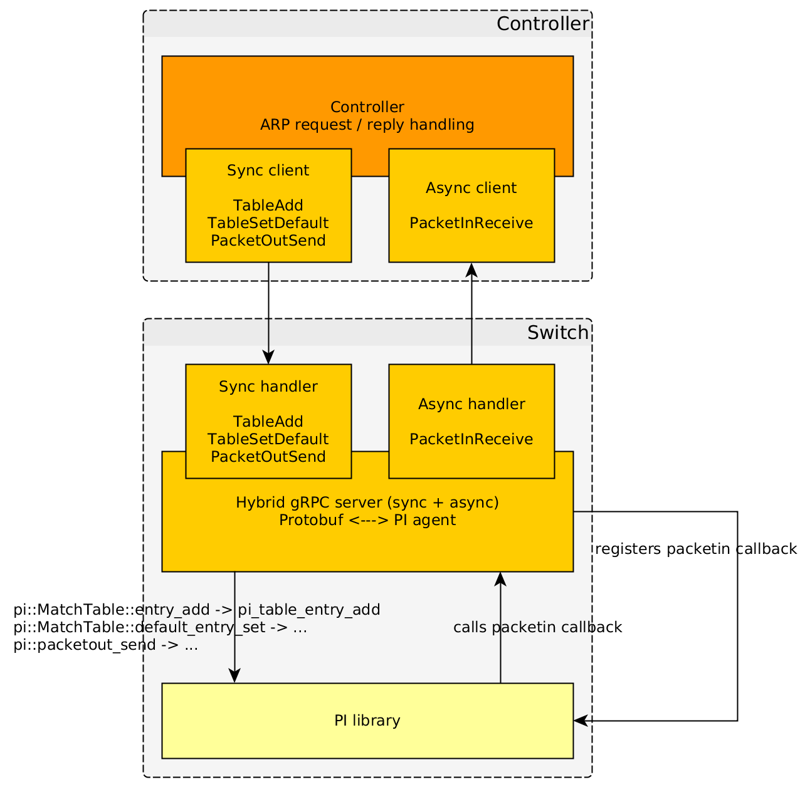

In this demo, we use gRPC + protobuf as the transport between the controller and
the switch. The gRPC server translates the protobuf messages into PI library
calls (using the PI C++ frontend).

To run the demo, you will need 3 terminal instances:
- `sudo python 1sw_demo.py --json simple_router.json --cpu-port veth250`
- `sudo ./pi_server`
- `sudo ./app -c simple_router.json`

Note that the demo assumes that you have a veth250 / veth251 veth pair on your
machine (used for the switch CPU port). You can create one with:
```
sudo ip link add name veth250 type veth peer name veth251
sudo ip link set dev veth250 up
sudo ip link set dev veth251 up
```

Once the PI server and the app / controller are running, you should be able to
send pings between h1 and h2.

Note that the controller also starts a web server on port 8888. The web page
lets you swap the P4 program (e.g. to simple_router_wcounter.json) and lets you
query a counter.
